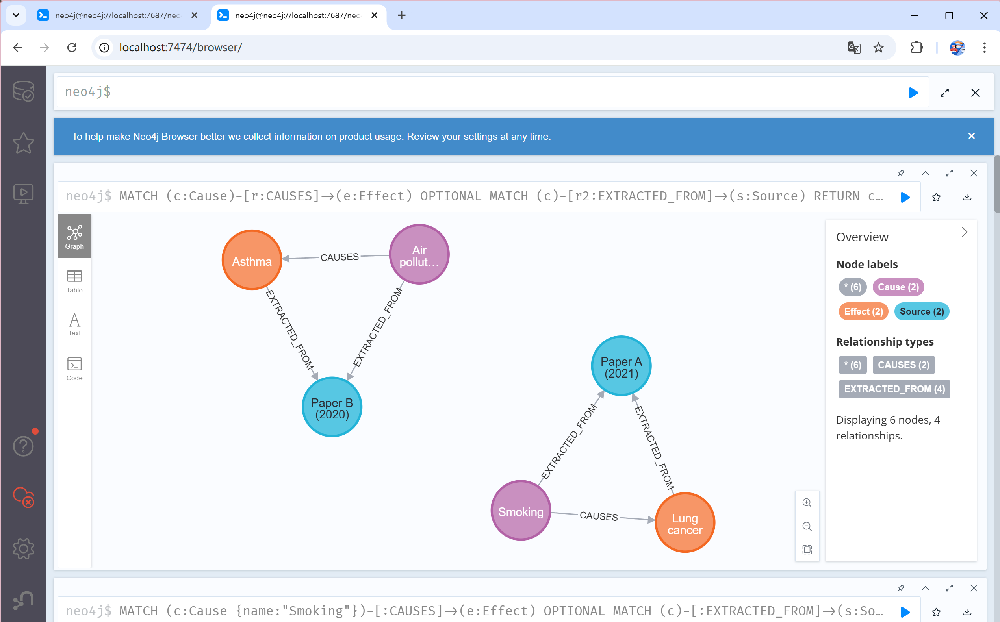

# COMP8715-CasualGraphAI

##  Introduction

This repository hosts the project for **COMP8715 (Causal Graph AI)**.  
Team members use this repository to manage code, configuration, and documentation throughout the semester.

> **Note:** Stakeholder information can still be recorded here temporarily, but the main focus is now on project deliverables.

---

##  Sprint-1 Deliverable: Neo4j MVP

In Sprint-1, we set up a **Minimum Viable Causal Knowledge Graph (KG)** using **Neo4j**.  
This environment demonstrates the ability to store and query **Cause → Effect** relationships with provenance.

---

##  Start Neo4j (via Docker Compose)

```bash
docker compose up -d
```

---

##  You Have Two Options to Load the Database:

###  Option A — Neo4j Browser (Step-by-Step)

1. Open the Neo4j Browser: [http://localhost:7474](http://localhost:7474)  
   - Username: `neo4j`  
   - Password: `neo4j123` (you may be prompted to change it)

2. Open the file `db/init.cypher` locally.

3. Copy **one block at a time** (each block ends with a semicolon `;`) into the browser and run it.  
   - Example block:
     ```cypher
     CREATE CONSTRAINT cause_name_unique IF NOT EXISTS
     FOR (c:Cause) REQUIRE c.name IS UNIQUE;
     ```

---

###  Option B — cypher-shell (Run the Whole File)

1. Copy the init script into the container:

   ```bash
   docker cp db/init.cypher neo4j-mvp:/var/lib/neo4j/import/
   ```

2. Run it inside the container using cypher-shell:

   ```bash
   docker exec -it neo4j-mvp bin/cypher-shell -u neo4j -p neo4j123 ":source /var/lib/neo4j/import/init.cypher"
   ```

---
##  Initial Schema Diagram

